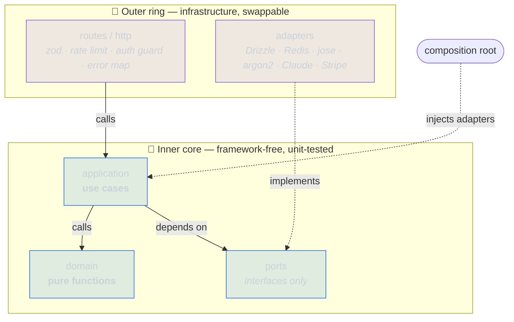
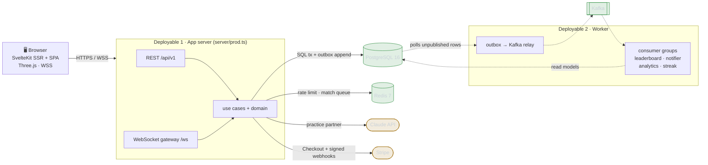
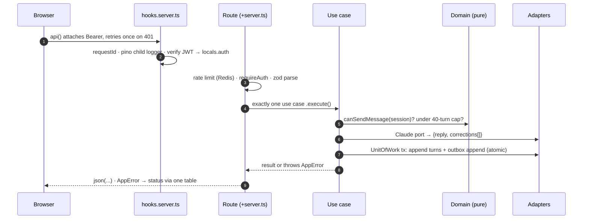

<div align="center">

# 🌐 LinguaLoop

### A production-grade language-practice platform — engineered as a portfolio piece

**Peer conversation exchange over WebSocket · AI practice on the Claude API · paid 1:1 lessons via Stripe**
Built on a hexagonal architecture with a functional core, an ADR for every non-trivial decision, and a
279-test suite that runs in ~1.3 s with **zero infrastructure**.

<br/>

<!-- LIVE DEMO: replace https://example.com below with your deployment URL, then change
     "add_url-8b949e" to "online-3fb950" so the badge reads green. -->
[](https://example.com)
[](https://github.com/321mask/LinguaLoop/actions/workflows/ci.yml)


<br/>

📄 **[Full system-design document (10-page PDF)](docs/lingualoop-system-design.pdf)** &nbsp;·&nbsp;
🗂️ **[13 Architecture Decision Records](docs/adr/)** &nbsp;·&nbsp;
📘 **[OpenAPI contract](docs/openapi.yaml)**

</div>

---

> [!NOTE]
> This document is a guided tour written for reviewers and hiring teams. It maps the codebase to the three
> things it is meant to demonstrate — **full-stack web development**, **system design**, and **security
> engineering** — and links every claim to the code that backs it. For the day-to-day build & run
> instructions, see the [developer guide](docs/DEVELOPMENT.md).

## What it demonstrates at a glance

| Competency | Where to look | Highlights |
| --- | --- | --- |
| **Full-stack web dev** | `src/routes`, `src/lib/ui`, `src/lib/client` | SvelteKit 2 SSR + SPA, Svelte 5 runes state, Tailwind 4 design tokens, a WebGL/Three.js interface, REST + WebSocket clients, typed end-to-end |
| **UI & design engineering** | [`src/app.css`](src/app.css), `src/lib/motion`, [design docs](docs/design/) | a bespoke token-driven design system (one token set, day + night), custom WebGL shaders, a 3D medallion family, designed reduced-motion fallbacks |
| **System design** | `src/lib/server`, [ADRs](docs/adr/), [PDF](docs/lingualoop-system-design.pdf) | Hexagonal architecture, transactional outbox → Kafka, two deployables from one image, read replica, partitioning, HPA manifests |
| **Security engineering** | [`hooks.server.ts`](src/hooks.server.ts), `application/auth`, `application/mfa` | Argon2id, rotating refresh tokens with reuse detection, opt-in TOTP MFA with encrypted secrets, strict CSP, layered rate limiting |
| **Engineering discipline** | `*.test.ts`, [`ci.yml`](.github/workflows/ci.yml) | 279 fast tests + Testcontainers + Playwright, ADRs, deterministic domain, least-privilege CI |

---

## Table of contents

- [The product](#the-product)
- [Screenshots](#screenshots)
- [Architecture](#architecture)
  - [The dependency rule](#the-dependency-rule-one-diagram-that-explains-the-repo)
  - [System topology](#system-topology)
  - [One request through the hexagon](#one-request-through-the-hexagon)
- [Security engineering](#security-engineering)
- [System-design decisions worth calling out](#system-design-decisions-worth-calling-out)
- [Testing strategy](#testing-strategy)
- [Front-end & design engineering](#front-end--design-engineering)
- [Tech stack](#tech-stack)
- [Run it locally](#run-it-locally)
- [Repository map](#repository-map)

---

## The product

LinguaLoop gives a language learner three ways to practise, all feeding one progress model:

- **🤝 Peer exchange** — live matchmaking over WebSocket. The domain scores compatibility (you speak what
  your partner is learning and vice-versa, at an adjacent CEFR level) and pairs the best match over a
  threshold, then relays a persisted 1:1 chat.
- **🤖 AI practice** — a Claude-powered partner that stays in character and returns **structured
  corrections** (`{ original, corrected, explanation }`) rendered as the product's core interaction and
  saved into a spaced-repetition (SM-2) review deck.
- **🎓 Paid 1:1 lessons** — Stripe Checkout booking on real availability, settled by a signed webhook, not
  the browser redirect.

Progress is gamified with daily streaks and a **7-tier 3D medallion family rendered in Three.js**. An admin
console and a public leaderboard sit on read models fed by the event pipeline.

---

## Screenshots

> [!NOTE]
> The frames below are design-language mock-ups checked into
> [`docs/screenshots/`](docs/screenshots/). Swap them for real captures of the running app (same
> filenames) and this section updates itself — nothing else to change.

<p align="center">
  
</p>

<table>
  <tr>
    <td width="50%" valign="top">
      <br/>
      <sub><b>AI practice · day theme</b> — every turn returns <code>{ original, corrected, explanation }</code>, rendered as an inline correction card (Gambarino italic for the corrected text) and saved to the SRS deck.</sub>
    </td>
    <td width="50%" valign="top">
      <br/>
      <sub><b>Dashboard · night theme</b> — daily streak, lifetime totals, and the medallion case (7 Three.js tiers) — one of two surfaces that never flip to day.</sub>
    </td>
  </tr>
</table>

<p align="center">
  
</p>

---

## Architecture

The whole codebase is shaped by one idea: **business rules are pure functions that know nothing about HTTP,
SQL, or any vendor.** Everything else — SvelteKit, Postgres, Redis, Stripe, Claude — is a replaceable
detail bound at the edges. This is [hexagonal / ports-and-adapters architecture](docs/adr/001-hexagonal-architecture-functional-core.md)
with a functional core.

### The dependency rule (one diagram that explains the repo)

Imports point **inward only**. Adapters implement interfaces (`ports`) defined by the inner layers; the
**composition root** is the single place where a concrete adapter is ever wired to a port.



Because **time and randomness are ports too** (`Clock`, `IdGenerator`), every use case is deterministic
under test — a `FakeClock` you can advance, sequential ids you can assert on. That is also why the July 2026
visual redesign was a *reskin, not a rewrite*: pages kept ownership of fetching and state while every
component below them stayed presentational.

### System topology

Two Node deployables share one TypeScript codebase and one Docker image
([ADR 004](docs/adr/004-single-repo-two-deployables.md)). Solid = synchronous; dashed = asynchronous/event
traffic.



The **outbox row commits in the same transaction as the state change**, so an event can never disagree with
the data that produced it — the classic dual-write problem, solved without distributed transactions
([ADR 005](docs/adr/005-outbox-from-day-one.md)).

### One request through the hexagon

Every endpoint follows the exact same shape; the WebSocket gateway enters at step 4 with the *same* use
cases. Example: `POST /api/v1/practice/sessions/:id/messages`.



Key invariants this enforces:

- Use cases throw **one** error type (`AppError` with a code); routes never branch on business outcomes —
  a single table in [`http/errors.ts`](src/lib/server/http/errors.ts) maps codes → HTTP status.
- **All multi-write flows share one transactional `UnitOfWork`**, which is exactly what makes the outbox
  atomic.
- Rate limiting **fails open**: Redis being down must never take authentication down with it.

---

## Security engineering

Security is treated as a first-class design concern, not a checklist bolted on at the end. Highlights, each
linked to the code:

### Authentication & session management

- **Password hashing** — Argon2id at OWASP-recommended parameters (`memoryCost 19456`, `timeCost 2`,
  `parallelism 1`) via `@node-rs/argon2`. Login performs **one hash verification on both success and
  failure paths**, so accounts can't be enumerated by response message *or* timing.
- **Split-token sessions** ([ADR 003](docs/adr/003-jwt-access-rotating-refresh-tokens.md)) — a short-lived
  15-minute HS256 JWT access token kept in memory, paired with an opaque **rotating** refresh token. The
  refresh token is stored only as a SHA-256 hash and lives in an `httpOnly`, `SameSite=Strict` cookie
  **scoped to `/api/v1/auth`**.
- **Refresh-token reuse detection** — every rotation links the new token to its predecessor. Presenting an
  already-rotated token is treated as theft and **revokes the entire token family**, logging out both the
  attacker and the legitimate client. The revocation is written *and returned* rather than thrown, so it
  survives the surrounding transaction — a subtle correctness detail worth reading in
  [`refresh-session.ts`](src/lib/server/application/auth/refresh-session.ts).

### Two-factor authentication (opt-in TOTP)

- **Standards-based** — RFC 6238 TOTP verified server-side, hand-rolled on `node:crypto` and
  [tested against the RFC test vectors](src/lib/domain/auth/totp.test.ts).
- **Secrets encrypted at rest** — TOTP secrets are stored **AES-256-GCM** encrypted under a *separate*
  `MFA_ENCRYPTION_KEY`, so a database-only leak exposes nothing usable ([cipher](src/lib/server/adapters/auth/aes-gcm-secret-cipher.ts)).
- **Hardened login flow** — a two-step login issues a **distinct-audience challenge token** that is never
  valid as a session token; codes are **single-use** (a replay cursor rejects reuse) and per-account
  rate-limited; recovery codes are stored hashed and single-use; disabling MFA **re-proves password + a
  code**.

### Transport, headers & browser hardening

- **Strict CSP** via SvelteKit's `kit.csp` ([config](svelte.config.js)) — nonced scripts, `script-src
  'self'`, `object-src 'none'`, `frame-ancestors 'none'`, `base-uri 'self'`, `form-action 'self'`.
- **Defence-in-depth headers** ([`hooks.server.ts`](src/hooks.server.ts)) — `nosniff`,
  `X-Frame-Options: DENY`, `Referrer-Policy`, a locked-down `Permissions-Policy`, `COOP`, and **HSTS in
  production** (2 years, `includeSubDomains`, preload-ready).

### Abuse & denial-of-service controls

- **HTTP rate limiting** — a Redis sliding-window limiter on register / login / refresh, keyed per-IP, that
  **fails open** and sets `Retry-After`.
- **WebSocket gateway hardening** ([`gateway.ts`](src/lib/server/realtime/gateway.ts)) —
  authenticate-by-first-message behind a **10 s deadline** (unauthenticated sockets are closed `4401`), a
  per-socket flood limit (30 msgs / 10 s, hard disconnect at 3×), one live socket per user, and a
  **zod-validated** wire protocol so malformed frames are rejected, not parsed.

### Secure-by-default operations

- **Fail-closed configuration** — the environment is [zod-validated at boot](src/lib/server/config.ts);
  production **refuses to start** on the placeholder `JWT_SECRET` or `MFA_ENCRYPTION_KEY`.
- **Graceful credential degradation** — missing Claude/Stripe keys downgrade *only* the affected endpoints
  to `503`; they never cause a boot failure or leak a stack trace.
- **Least-PII event log** — domain events carry ids, not personal data, so the event history is safe to
  retain indefinitely; consumers that need details fetch them.
- **Locked-down ops surface** — `/metrics` requires a bearer token and 404s in production without one; CI
  runs with a least-privilege `GITHUB_TOKEN` (`contents: read` by default) and a clean `npm audit`.

---

## System-design decisions worth calling out

Every non-trivial decision has a short [ADR](docs/adr/) explaining the context, the choice, and the
trade-offs. A few favourites:

<details>
<summary><b>Transactional outbox from day one</b> — atomic events without distributed transactions</summary>

<br/>

An `outbox_events` row is appended **inside the same transaction** as the state change that produced it
([ADR 005](docs/adr/005-outbox-from-day-one.md)). In Phase 2 a worker polls unpublished rows and relays them
to Kafka, where idempotent consumer groups (leaderboard-updater, notifier, analytics-writer,
streak-updater) build read models and fire side effects
([ADR 010](docs/adr/010-outbox-kafka-relay-and-consumers.md)). The app never talks to Kafka directly — it only
writes the outbox — so the write path stays simple and correct even before the broker exists.
</details>

<details>
<summary><b>Booking correctness under concurrency</b> — a database invariant, not application logic</summary>

<br/>

A checkout claims a slot with a **35-minute pending hold** while the Stripe session stays payable for 30 —
the payment window sits *strictly inside* the hold, so a payment can never complete after its hold lapsed.
Concurrent claims on the same slot are settled by a **partial unique index**
(`bookings(starts_at) WHERE status IN ('pending','confirmed')`); the losing `INSERT` surfaces as a clean
`CONFLICT 409`. The **webhook is the source of truth**; the success page only polls. Stale holds expire
lazily inside the next claim's transaction — no background job needed
([ADR 009](docs/adr/009-stripe-checkout-booking.md)).
</details>

<details>
<summary><b>Scaling the read path</b> — replicas, partitioning, and a queue that grows up</summary>

<br/>

`practice_sessions` is **monthly-partitioned** with an index that matches the partition key
([ADR 011](docs/adr/011-practice-sessions-partitioning.md)); dashboard and leaderboard queries are served from
a **read replica** that falls back to the primary in single-node dev
([ADR 012](docs/adr/012-read-replica-for-projections.md)). The match queue lives behind a `MatchQueue` port —
in-memory today, Redis-backed at scale-out — so horizontal scaling is a swap of one adapter, not a rewrite
([ADR 007](docs/adr/007-websocket-matching-architecture.md)).
</details>

<details>
<summary><b>One image, two deployables</b> — shared domain, typed end to end</summary>

<br/>

The app server and the worker are built from a single Docker image and share the same ports, adapters, and
domain; each has its own composition root ([ADR 004](docs/adr/004-single-repo-two-deployables.md)). Kubernetes
`Deployment` + `HPA` manifests for both live in [`deploy/k8s/`](deploy/k8s/), and CI publishes the image
to GHCR on every push to `main`.
</details>

<details>
<summary><b>AI practice entitlements & billing</b> — quota, credits, and a wallet-safe ceiling</summary>

<br/>

AI practice spends real Claude tokens, so it's gated at session start by a pure entitlement function: the
daily tier allowance (Free 3/day · Plus 10 · Pro unlimited) is spent first, then purchased credits, else
`QUOTA_EXCEEDED`. Credit spend is an atomic conditional decrement; the quota is a soft read. A separate
**global daily spend ceiling** decorates the AI port — a Redis meter that trips practice to 503 across all
users past a configurable cap, independent of per-user limits. Paid upgrades (Stripe subscriptions) and
one-time credit packs settle via signed webhooks, idempotent by construction — a unique `stripe_event_id`
per grant and last-writer-wins subscription upserts, so no dedup table is needed
([ADR 014](docs/adr/014-ai-entitlements-and-billing.md)).
</details>

---

## Testing strategy

The test pyramid is built so that the fast, high-value tests need **no infrastructure at all** — pure
domain functions and use cases run against in-memory fakes of every port, with rollback-on-throw semantics
that mirror Postgres.

```
✓ 279 unit + use-case tests · 37 files · ~1.4 s · zero infrastructure
```

| Level | Tooling | What it proves |
| --- | --- | --- |
| **Domain unit** | Vitest, no fakes | pure functions: match scoring, streaks, SM-2, pricing, idempotency, turn caps |
| **Use case** | Vitest + in-memory fakes | orchestration, transaction rollback, outbox appends |
| **Adapter** | Vitest + recorded fixtures | Claude response parsing, TOTP RFC vectors, error mapping |
| **Integration** | [Testcontainers](tests/integration/) (real Postgres 16 + Redis 7) | constraints, tx atomicity, consumer dedup, partition routing |
| **End-to-end** | [Playwright](tests/e2e/) | register → profile → dashboard → re-login, plus public pages |

CI runs all five layers on every push and pull request ([`ci.yml`](.github/workflows/ci.yml)).

---

## Front-end & design engineering

The UI is not a component library with a coat of paint — it's a **bespoke design system** with its own
tokens, typography, motion vocabulary, and written rules, implemented over strictly **presentational**
components: pages own fetching, WebSocket state, and auth; everything below them is props-in /
callbacks-out. Global state is Svelte 5 **runes** (`auth.svelte.ts`, `theme.svelte.ts`,
`navStatus.svelte.ts`); `api()` attaches the Bearer token and retries exactly once through a refresh on
401, so no component ever sees token plumbing.

### One token set, two themes

All color lives in **one semantic token set** — a Tailwind 4 `@theme` block in
[`src/app.css`](src/app.css). Night mode overrides *the same custom properties* under
`[data-theme="night"]`, so every `bg-surface` / `text-accent` utility flips automatically: **zero
component edits, zero `dark:` variants.** A boot snippet in `app.html` applies the stored theme before
first paint — no flash.

| Token | ☀️ Day | 🌙 Night | Carries |
| --- | --- | --- | --- |
| `--color-bg` | `#F0F3F1` | `#0D2B28` | page background |
| `--color-text` | `#14201D` | `#EAF3EE` | primary text |
| `--color-accent` | `#0E7A57` green | `#5BC9A2` mint | actions, links, selection |
| `--color-brass` | `#A5761C` | `#DFA345` | streak progress, correction marks |
| `--color-alert` | `#BE4B3F` | `#D97E72` *(lifted for contrast)* | errors |
| `--color-bubble-self` | ink on paper | chalk on board | the learner's own words |

Three typefaces, three jobs — **Satoshi** (body & UI, variable), **Tanker** (display and *every* big
number), **Gambarino** italic (reserved exclusively for corrected text and editorial asides) — plus
monospace micro-labels at 10–12 px for status and metadata.

### Rules the design enforces

Written rules, not vibes — each one is visible in the frames above:

- **Two surfaces never flip.** The landing "board" band and the medallion case are always dark, in both
  themes — they use theme-independent `board`/`chalk`/`mint` tokens.
- **Your own words are always on the board.** The learner's chat bubble is the highest-contrast voice on
  every screen: ink-on-paper by day, chalk-on-board by night.
- **Brass never carries text at or below 18 px on tinted fills** (a contrast rule, enforced in review).
- **Tabular numerals on every count** — streaks, timers, scores, ranks never jitter as they tick.
- **The medallions are the only celebration in the product.** Everything else stays restrained.

### Motion & WebGL

The motion system is hand-built (no animation library), sharing one scroll-velocity pipeline
(`lerp 0.1 · decay 0.85`) in [`src/lib/motion/`](src/lib/motion/):

| Primitive | What it does |
| --- | --- |
| `VelocityHeadline` | WebGL sine-stretch shader distorts the landing headline by scroll velocity — the DOM text stays in place for screen readers and *is* the no-WebGL / reduced-motion fallback |
| `SplashLoader` | eased percent counter with a cursor trail of greeting words in 14 languages |
| `BoardGrid` | infinite drag grid (300 × 176 tiles wrapping both axes) with flick inertia, idle drift, and full arrow-key navigation |
| `TimeWheel` | scroll-snap booking picker whose settle logic skips taken slots |
| `MedallionCase` | 7-tier Three.js coin family, **every texture generated on canvas** (no image assets), with a strike animation |

WebGL runs under an explicit **performance contract**: one context per page, lazy-init, paused
off-screen, disposed on route change — and nothing is ever allowed to jank a text input.

### Accessibility is designed, not patched

Every animated element ships with a *designed* `prefers-reduced-motion` fallback — a deliberate static
composition, not a disabled animation. WebGL failures fall back to styled DOM. Corrections and match-state
changes are announced via `aria-live`; the drag grid and the time wheel are fully keyboard-operable; every
focusable element gets a visible `:focus-visible` ring.

### The design process is part of the portfolio

The system was built brief → prototype → handoff → implementation, and the artifacts are in the repo: two
written design briefs ([round 1](docs/design/claude-design-brief.md) ·
[round 2](docs/design/claude-design-brief-2.md)) and a [handoff spec](docs/design/handoff/) documenting
every screen with exact sizes, colors by token name, animation constants, and a per-element reduced-motion
fallback. Because the components are presentational and the tokens are semantic, the July 2026 visual
redesign was **a reskin, not a rewrite**.

---

## Tech stack

| Concern | Choice | Why |
| --- | --- | --- |
| **Front end** | SvelteKit 2 · Svelte 5 runes · TypeScript · Tailwind 4 · Three.js r160 | SSR landing for SEO, SPA app area; runes give lean reactive state |
| **Back end** | SvelteKit endpoints + a plain Node worker, one shared codebase | routes are a thin HTTP shell over framework-free use cases |
| **Data** | PostgreSQL 16 (Drizzle ORM, generated SQL migrations) · Redis 7 | explicit SQL over magic; Redis for rate limits & the scale-out queue |
| **Async** | Transactional outbox → Kafka relay + consumer groups | events atomic with state changes long before Kafka exists |
| **External** | Claude API (practice partner) · Stripe Checkout (payments) | both behind ports; missing credentials degrade to 503 |
| **Auth** | Argon2id · HS256 JWT + rotating refresh · optional TOTP MFA | reuse detection burns the token family; secrets encrypted at rest |
| **Testing** | Vitest · Testcontainers · Playwright | 279 tests in ~1.3 s with zero infrastructure |
| **Ops** | `/healthz` · `/readyz` · `/metrics` (Prometheus) · pino · request ids | docker-compose locally; Kubernetes + HPA at scale |

---

## Run it locally

Prerequisites: **Node ≥ 22** and **Docker** (for Postgres + Redis).

```bash
docker compose up -d          # Postgres 16 + Redis 7
cp .env.example .env          # defaults match docker-compose
npm install
npm run db:migrate            # apply Drizzle migrations
npm run dev                   # SvelteKit app on :5173
npm run worker:dev            # worker process (Phase 2 consumers)
```

Smoke test:

```bash
curl -s -X POST localhost:5173/api/v1/auth/register \
  -H 'content-type: application/json' \
  -d '{"email":"me@example.com","password":"correct-horse-1","displayName":"Me"}'
```

Full commands (tests, integration, e2e, lint, typecheck, Docker) are in the [developer guide](docs/DEVELOPMENT.md).

---

## Repository map

```
src/
  lib/
    domain/          # pure functions & entities — zero I/O, zero framework imports
    server/
      ports/         # interfaces: repositories, UnitOfWork, TokenService, Clock, …
      application/   # use cases — orchestrate domain + ports, constructor-injected
      adapters/      # postgres (Drizzle), redis, jose, argon2, Claude, Stripe, system
      composition/   # the composition root — the only place adapters meet ports
      http/          # route-boundary helpers: error mapping, zod parsing, guards
      realtime/      # WebSocket gateway (matching queue + peer chat)
    ui/ · motion/    # presentational Svelte components · animation primitives
    client/          # runes-based client state (auth, theme, api helper)
  routes/            # SvelteKit pages + /api/v1 endpoints — thin HTTP ⇄ use-case
worker/              # standalone process: outbox → Kafka relay + consumers
deploy/k8s/          # Kubernetes Deployment + HPA manifests
docs/adr/            # 13 architecture decision records
docs/openapi.yaml    # API contract, maintained alongside the code
drizzle/             # generated SQL migrations
```

---

<div align="center">

**Built by Arseny** · [MIT Licensed](LICENSE) ·
[System-design PDF](docs/lingualoop-system-design.pdf) · [ADRs](docs/adr/) · [Developer guide](docs/DEVELOPMENT.md)

</div>
